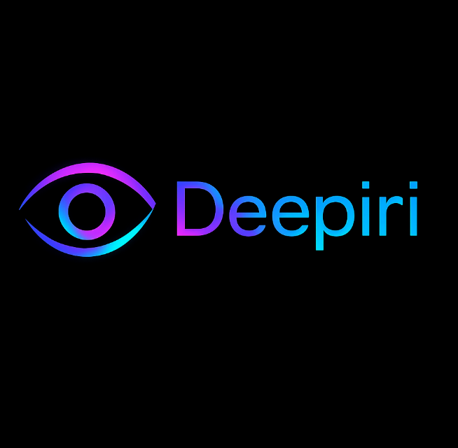

# Deepiri

**Deepiri** is a collaborative grassroots open source R&D software development team focused on designing, building, and scaling **AI productivity tools**. Our mission is to create modern, modular, and maintainable solutions that leverage cloud-native architectures, AI-powered automation, and cutting-edge development practices.

---

## Our Mission

Our mission is to design and deploy scalable AI systems that bridge research and real-world application — integrating autonomy, security, and performance into every layer of computation.

---

## Connect With Us

**Website** https://deepiri.com

**GitHub:** [Deepiri](https://github.com/deepiri)  

**Discord:** [Deepiri Discord](https://discord.gg/B3Tx4Wmx)  

**Email:** management@deepiri.com

**Support Inquiries** helpdesk@deepiri.com

---

## Contribution

Send your resume to helpdesk@deepiri.com to be considered to be apart of our team!

---

---
