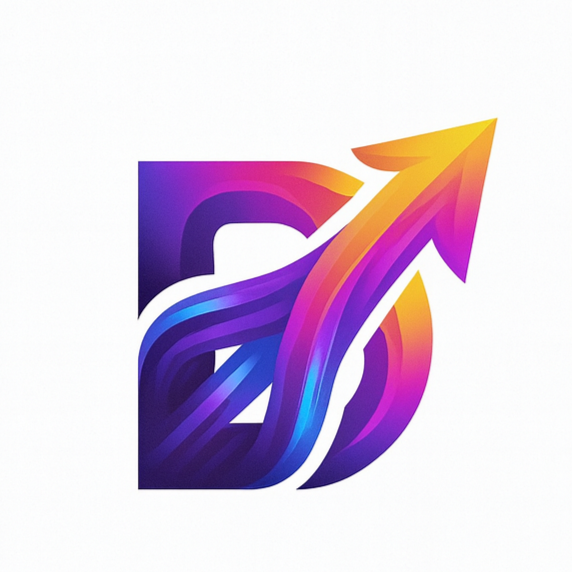
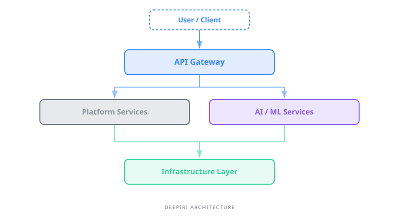

# Deepiri

An open source organization currently focused on building an **intelligence platform for building scalable AI-powered data ingestion and automated workflows.**

 

 

<a href="#overview">Overview</a> ·
<a href="#the-deepiri-philosophy">Philosophy</a> ·
<a href="#key-principles">Key Principles</a> ·
<a href="#tech-stack">Tech Stack</a> ·
<a href="#prerequisites">Prerequisites</a> ·
<a href="#getting-started">Getting Started</a> ·
<a href="#architecture">Architecture</a> ·
<a href="#engineering-standards">Engineering Standards</a> ·
<a href="#roadmap">Roadmap</a> ·
<a href="#collaboration--support">Collaboration & Support</a> ·
<a href="#team--mission">Team & Mission</a> ·
<a href="#license">License</a>

---
# Deepiri

## Overview

Deepiri is an independent AI research and development collective focused on building advanced productivity platforms and autonomous systems. Operating at the intersection of modular microservice architecture, generative intelligence, and adaptive human–AI interaction, the group explores how intelligent systems can become scalable, creative, and self-managing.

With a globally distributed team of 35+ developers, Deepiri researches and prototypes AI-driven frameworks for media ingestion, automation, cognitive computing, and cloud productivity. The organization emphasizes modular, flexible system design—enabling AI platforms that evolve, integrate, and operate across distributed environments.

Deepiri’s goal is not only to research artificial intelligence, but to translate that research into practical platforms that enhance human capability and expand what autonomous systems can responsibly achieve.

---

## Team Mission

Deepiri’s mission is to design and develop scalable AI systems that augment human productivity while maintaining alignment, adaptability, and long-term sustainability.

The team is committed to:

- Advancing modular AI architectures that support flexibility and long-term maintainability  
- Building generative systems capable of creative and adaptive problem-solving  
- Designing intuitive human–AI interfaces that enhance collaboration rather than replace it  
- Developing autonomous frameworks that operate independently while remaining aligned with human goals  
- Leveraging cloud infrastructure to enable distributed, high-performance AI workloads  

Through research, experimentation, and collaboration, Deepiri aims to shape the next generation of intelligent productivity platforms.

---

## Philosophy

### 1. Modularity Enables Intelligence  
Scalable AI systems must be composable and adaptable. Modular architecture allows innovation without fragility.

### 2. Human-Centered Autonomy  
Autonomous systems should extend human creativity and productivity—not diminish agency or control.

### 3. Creativity Through Generative Intelligence  
AI should not merely automate tasks; it should generate novel solutions and adapt dynamically to complex environments.

### 4. Alignment and Responsibility  
Intelligence without alignment introduces risk. Deepiri prioritizes responsible system design, ensuring autonomy operates within human-defined objectives.

### 5. Research with Practical Impact  
Exploration drives innovation, but practical implementation creates impact. Deepiri is committed to transforming research into real-world AI platforms.
### Connect With Us

| Resource | Contact |
|:---------|:--------|
| **Website** | [deepiri.com](https://deepiri.com) |
| **Discord** | [Deepiri Discord](https://discord.gg/B3Tx4Wmx) |
| **General Email** | [management@deepiri.com](mailto:management@deepiri.com) |
| **Support Inquiries** | [helpdesk@deepiri.com](mailto:helpdesk@deepiri.com) |

## The Deepiri Philosophy

We believe that architecture is a living entity. Most platforms fail because they allow "architectural rot" — the slow creep of technical debt that makes systems impossible to maintain.

Deepiri is built to enforce:

- **Strict Logic Isolation** — no service leaks data into another
- **Environment Parity** — if it doesn't run in `run_dev.py`, it doesn't run in production
- **AI-Native Flow** — AI agents are system actors with their own ports and execution cycles, not chatbots bolted on afterward

## Key Principles

- **Clear domain boundaries** — every service owns its logic and data
- **Infrastructure realism** — local dev mimics production behavior
- **Minimal developer friction** — complexity lives in the platform, not the workflow
- **AI as a first-class system component**, not an afterthought

---

## Tech Stack

| Layer | Technologies |
|:------|:-------------|
| **Backend** | Node.js, Python (FastAPI / Flask), Go |
| **Frontend** | React.js, Vue.js, TypeScript |
| **Databases** | PostgreSQL, MongoDB, Redis, InfluxDB, Milvus |
| **Object Storage** | MinIO |
| **Coordination** | etcd |
| **AI / ML** | PyTorch, TensorFlow, NLP & ML APIs |
| **Cloud & DevOps** | Docker, Kubernetes, AWS, GCP, CI/CD pipelines |
| **Monitoring & Logging** | Prometheus, Grafana, ELK Stack |

---

## Prerequisites

Before running the stack, ensure the following are installed:

| Requirement | Minimum Version | Notes |
|:------------|:----------------|:------|
| **Python** | 3.10+ | Required for `run_dev.py` and Cyrex |
| **Node.js** | 18+ | Required for all TypeScript services |
| **Docker** | 24+ | Required for all containerized runtimes |
| **kubectl** | 1.27+ | Required for K8s secret management |

> **Windows users:** WSL2 is required. Native Windows is not supported.

---

## Architecture

  

---

## Engineering Standards

We move fast without compromising system integrity. All contributions follow our SDLC:

- **Conventional Commits** — every commit must be prefixed (e.g., `feat:`, `fix:`, `docs:`) and follow our commit template for consistency
- **Domain-Specific Targeting** — contributors target the dev branch for their specific service
- **QA Verification** — all PRs are reviewed to ensure system integrity is maintained, features work as intended, and Docker containers are healthy

---|

---

## Collaboration & Support

We are a small, high-velocity team. To maintain our pace, we follow a spec-first collaboration model:

- **Issue Reporting** — before opening a PR, ensure there is an associated Issue with a defined Spec, Scope, and Success Criteria
- **Active Development** — we prioritize PRs that align with our philosophy and pass strict QA verification

### Join the Team

We're always looking for contributors and collaborators. Send your resume or portfolio to [helpdesk@deepiri.com](mailto:helpdesk@deepiri.com) to be considered for our open-source R&D team.

---

 

**Code should scale as well as your ideas.**

*Deepiri makes that the default.*

